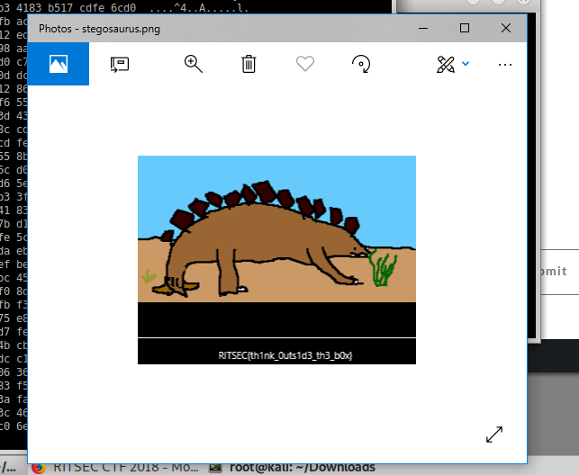

Stegosaurus
-----------

Easy method
-----------
1. Open the CRC error image in "Windows Photos". Image "Capture4.PNG"
2. Read the Flag

Difficult method
----------------
1. Try to open image should fail, due to CRC error.
2. Scan image with "pngcheck".
   - This shows the CRC error, its expected value and its computed value
   - Image Capture.PNG
3. Read the file format of PNG
   - https://www.w3.org/TR/PNG-Structure.html
   - States that the format is:
     1. a default hex sequence
     2. 4B length
     3. 4B chunk type
     4. Chunkc data
     5. 4B CRC
4. Change the CRC code to the expected value using an hexeditor.  Eg. as below
   - Open image in editor: "vim stegosaurus.png"
   - Convert content to readable hex data ":%!xxd"
   - Edit the content. Image "Capture3.PNG"
   - Convert back to binary data ":%!xxd -r"
   - Save content to file and exit ":wq"
5. Scan image with "pngcheck". Hopefully less errors
6. Open image in SXIV and read the code, "sxiv stegosaurus.png"
   - Image "Capture2.PNG"

