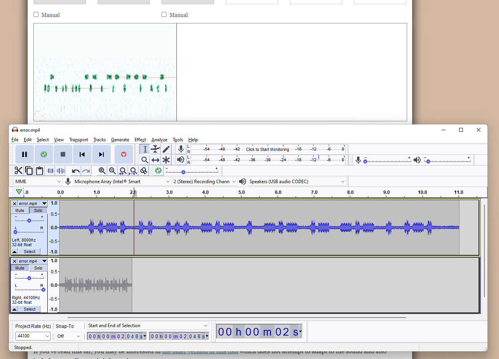

# KINS CTF 2021

## Blandet drops
### Nettverkstrafikk
#### Password
*Avdekk passordet til bobby.*  
This is FTP traffic, find the logon request requesting the username followed by the password request and response in cleartext.

#### Filproblemer
*Booby logger inn og laster ned et bilde. Bildet inneholder flagget. Klarer du å finne det i capture-filen?*  
Find the image transferred in the the FTP-data stream, Either by searching for the file header, "FFD8" or ".jpg". Select "Follow TCP Stream" and ave the data as RAW data with a `".jpg"` file extensionm

#### Zip
*Som du ser av capture-filen, så laster Bobby ned en zip-fil. Flagget ligger i zip-filen.*  
Two staged task.
1. Same as above, but for a ZIP archive and save it as "zippy.zip".
1. The archive is password encrypted, get the password hash from zip2john then use john-the-ripper and a password list to crack the cipher.


#### WiFI
*Du dumper trafikk fra et trådløst nettverk. Avdekk passordet til det trådløse nettverket.*  
This is a two stage task
1. Get the BSSID with airodump-ng, as it lists all the BSSIDs found int he capture file.  Find the BSSID you wish to crack, the file only contained one BSSID.
1. Use aircrack-ng along with a wordlist to crack the password


### Kryptografi

#### RSA 1
*RSA er asymmetrisk krypteringsalgoritme som har tatt verden med storm. Men den har også noen svakheter. En av svakhetene handler om at hvis n kan faktoreres, så kan p og q avdekkes, og dermed kan vi finne d. Klarer du å avdekke flagget som er kryptert i fila?*  
Solution is based on the guide at hxxps://www.quaxio[.]com/exploring_three_weaknesses_in_rsa/
```
n: 14303657909586312103
e: 65537
c: 6900904302982267153 693876050691083674 4141088510273195856 11127363963041300057 9046085088504559521 
   776466381349713308 12148215166907619825 3342190531754372368 8748929379460331051 11108831615027604419 
   11100671542703215364 5754721234378471627 1169669775855045345 12148215166907619825 8748929379460331051 
   5754721234378471627 4220426181738910373 1514197323599635879 8614376149838746704 5754721234378471627 
   6814560179375283738 8614376149838746704 8748929379460331051 68365194311002045 10335083035516207339 
   8614376149838746704 7895876405233979833 11108831615027604419 10033439684951233584 1514197323599635879 
   776466381349713308 12148215166907619825 7875063772329185793 7875063772329185793 8614376149838746704 
   4220426181738910373 776466381349713308 8614376149838746704 11100671542703215364 6814560179375283738 
   7535196464565304341 563469159965794187     
```
1. Since N is possible to factorize, we can generate N-factorial
2. Using N! we get `q` and `p`
```
N=	14303657909586312103
p=	3342608057
q=	4279190879
```
3. Compute `Phi`, using `q` and `p`
```
Phi = (p-1)*(q-1)
Phi = 14303657901964513168
```
4. Compute D
```
d = (e^(-1)) % Phi
d = 7083188329498700129
```
5. D which is then used to decrypt the ciphertexts in array `c`, `(c^d) % n`
```language=Python
ptext = ""
for cc in c:
	ptext += chr( pow(c, d, n) )
print(ptext)
```

#### RSA 2
*Her er en annen RSA-utfordring. I denne oppgaven får du bare den krypterte teksten og eksponenten. Merk at eksponenten er veldig lav. Klarer du å avdekke flagget?*

- Given that **e** is extremely low, eg 3 ro 7, cryptogram is reversible as `C = M^e => M = M = cuberoot(C)` as e = 3

```language=python
import gmpy2
ct = 952932520152505076450616768391060526396245777971871094728426279579608694090391150925326882488170205393577232519350919237190271085334703491558670100224819474519580670324235150531269871256970352346314998542204245346815707385295579111157877967445383012812757998671981071773495877677105622571794719670571575830373
e = 3
hString = hex( gmpy2.iroot(ct, e)[0] )
```

**Flag:** `FLAG{RSA_or_!_that_is_the_1000000_question}`


### Sårbare tjenester
#### Tom & Jerry
1. Using a dictionary attack on default passwords for Apache tomcat we git the management-gui username and password "tomcat/tomcat".
1. Then we could upload a WAR file to the tomcat which runs under the process of tomcat.
1. Uploading a malicious war file with a web-shell, gives the ability to issue commands
1. running `cat /root/.bash_history`, gave us the flag being written to disk using nano in the `conf` folder of the apache tomcat directory
1. `cat ./conf/FLAG.txt` gives the flag.


### Multimedia
#### Error
The high pitched audio sounded like morse code.
Lowering the sampling rate in Audacity, basically extenTranslating the Audio morse code signal yields the following morse code string, `..-. .. ... -.- . -.- .- -.- . .-. `, which translates into `FISKEKAKER`  



### Hasher
#### MS-CHAPv2
Crack it using "assless-chaps" and the HaveIBeenPwnd NTLM password list.

#### NTLM1
*Avdekk passordet til denne ntlm hashen: `40F4995D57BEE67D3ADF04960D85055B` Oppgi svaret i formatet: FLAG{passord}*

Kommando: hashcat.exe -m 1000 -a 0 40F4995D57BEE67D3ADF04960D85055B ..\rockyou.txt -r rules\rockyou-30000.rule

Fant riktig passord etter ca 72% av searchspace: adventistlui0716593!

#### NTLM2
*Avdekk passordet til denne ntlm hashen: `E8091CA6AEB7B308FC1605B52B9A4218` Oppgi svaret i formatet: FLAG{passord}*

Checking online services yielded the answer, as `maquinadegerra` on "hxxps://hashes[.]com/"


#### DCC2
*Du henter ut følgende cached credentials fra en domenemaskin.*  
`$DCC2$10240#nifsenils#faa175fd4dcfc8cd2d0760e2e9e295bf`  
*Som du vet tar det laaang tid å cracke cached credentials, men heldigvis vet du litt om hvilke mønster som denne brukeren vanligvis bruker for å lage passord. Kanskje du kan redusere entropien ved å være litt smart, og dermed avdekke passordet?*
```
Toyota7H1h0k1(
Subaru2E0f0k1)
Nissan9Z1h1k1(
Subaru0E0f0k1)
Toyota2J1h0k0(
Toyota7K1f0k1(
Subaru3N0h1k0(
Nissan8M1g1k1)
Toyota2D0g0k0)
Subaru4Q1f1k1(
Toyota6D0h1k0)
```

1. Extrapolate the password pattern from the above
`(Toyota|Subaru|Nissan)[0-9][A-Z][01][hfg][01]k[01][)(]`
1. Convert the regex above to a runable mask and feed it to johns bruteforce.
- `Toyota[0-9][A-Z][01][hfg][01]k[01][)(]`
- `Subaru[0-9][A-Z][01][hfg][01]k[01][)(]`
- `Nissan[0-9][A-Z][01][hfg][01]k[01][)(]`


## Enkoding og obfuskering
### Tallrekke
The PDF contained an image of a bunch of onions with a hex string superimposed on top.
```
6a6c76687661676b63696b7975627a7172726b
6975786c3271346935726e746c713379613263
74627873723579666f62376b7062326a71642f
696e646578322e68746d6c
```
The string turns into: `jlvhvagkcikyubzqrrkiuxl2q4i5rntlq3ya2ctbxsr5yfob7kpb2jqd/index2.html`, which is a hash of an Onion site and the context path of its landing page.
`jlvhvagkcikyubzqrrkiuxl2q4i5rntlq3ya2ctbxsr5yfob7kpb2jqd[.]onion[/]index2.html`.